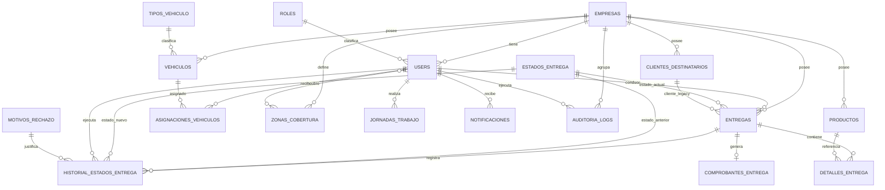

# ZonasCore API

API REST multiempresa para la plataforma logística **Zona Score**. Centraliza el registro de empresas, autenticación, administración de usuarios y choferes, creación y asignación de entregas, seguimiento de estados y auditoría de operaciones.

Este repositorio contiene el backend Laravel. El cliente móvil/web se encuentra en [TPI-PROG3-FRONT](https://github.com/LucianoJavierCostaPeralta/TPI-PROG3-FRONT).

## Funcionalidades

- Registro transaccional de una empresa junto con su primer administrador.
- Autenticación mediante tokens Bearer de Laravel Sanctum.
- Roles de administrador y chofer.
- Aislamiento de datos por empresa.
- ABM de usuarios y choferes.
- Creación, consulta, filtrado y asignación de entregas.
- Flujo operativo del chofer con validación del DNI del destinatario.
- Historial de estados de cada entrega.
- Auditoría de operaciones sensibles.
- Resumen operativo para el panel administrativo.
- Catálogo de estados de entrega.
- Especificación OpenAPI 3.1 generada automáticamente.
- Swagger UI con ejecución interactiva de endpoints.

## Tecnologías

- PHP 8.3 o superior.
- Laravel 13.
- Laravel Sanctum 4.
- Eloquent ORM.
- PostgreSQL en Render y MySQL para desarrollo local.
- Dedoc Scramble para OpenAPI.
- Swagger UI.
- PHPUnit 12.
- Laravel Pint.

## Requisitos

- PHP 8.3 o superior con las extensiones requeridas por Laravel y MySQL.
- Composer.
- MySQL 8 o compatible.
- Git.
- Node.js y npm solamente si se utilizan los recursos frontend incluidos por Laravel/Vite.

## Instalación

Clonar el repositorio:

```bash
git clone git@github.com:LucianoJavierCostaPeralta/TPI-PROG3-BACK-API.git
cd TPI-PROG3-BACK-API
```

Instalar dependencias y crear la configuración local:

```bash
composer install
cp .env.example .env
php artisan key:generate
```

Crear una base de datos MySQL y completar, como mínimo:

```env
APP_NAME=ZonasCore
APP_ENV=local
APP_URL=http://127.0.0.1:8000

DB_CONNECTION=mysql
DB_HOST=127.0.0.1
DB_PORT=3306
DB_DATABASE=prog3_backend
DB_USERNAME=root
DB_PASSWORD=
```

Crear las tablas y datos base:

```bash
php artisan migrate --seed
```

Iniciar la API:

```bash
php artisan serve
```

La URL base es:

```text
http://127.0.0.1:8000/api/v1
```

Para permitir conexiones desde Expo Go en un dispositivo físico:

```bash
php artisan serve --host=0.0.0.0 --port=8000
```

En ese caso, el frontend debe usar `http://IP_LOCAL_DE_LA_PC:8000/api/v1`.

## Datos iniciales

`DatabaseSeeder` crea los catálogos y una organización de desarrollo:

| Tipo | Valor |
| --- | --- |
| Empresa | Logística Central |
| Administrador | `admin@admin.com` / `123456` |
| Chofer | `chofer@logistica.com` / `123456` |
| Roles | Admin y Chofer |
| Tipos de vehículo | Moto, Furgoneta y Camión |
| Zonas | Norte, Sur y Centro |
| Motivos de rechazo | Domicilio cerrado, cliente ausente y dirección incorrecta |

Estas credenciales son exclusivamente para desarrollo. No deben utilizarse en producción.

## Integración con el frontend

El despliegue público está disponible en:

- API: [https://zonascore-api.onrender.com/api/v1](https://zonascore-api.onrender.com/api/v1)
- Health check: [https://zonascore-api.onrender.com/api/health](https://zonascore-api.onrender.com/api/health)
- Swagger UI: [https://zonascore-api.onrender.com/docs/api](https://zonascore-api.onrender.com/docs/api)

El proyecto Expo consume la API publicada mediante:

```env
EXPO_PUBLIC_API_URL=https://zonascore-api.onrender.com/api/v1
```

| Entorno del frontend | URL recomendada |
| --- | --- |
| Render / cualquier dispositivo | `https://zonascore-api.onrender.com/api/v1` |
| Emulador Android | `http://10.0.2.2:8000/api/v1` |
| Simulador iOS | `http://127.0.0.1:8000/api/v1` |
| Navegador web | `http://127.0.0.1:8000/api/v1` |
| Dispositivo físico | `http://IP_LOCAL_DE_LA_PC:8000/api/v1` |

Todas las respuestas son JSON. Las solicitudes deben enviar:

```http
Accept: application/json
Content-Type: application/json
```

Las rutas protegidas también requieren:

```http
Authorization: Bearer TOKEN
```

## Arquitectura

El backend utiliza una arquitectura por capas apoyada en las convenciones de Laravel:

```text
Cliente Expo / Swagger UI
          │ HTTP + JSON
          ▼
routes/api.php
          │
          ▼
Middleware ── auth:sanctum ── role:admin|chofer
          │
          ▼
Controllers ── validación y respuesta HTTP
          │
          ▼
Services ── casos de uso y operaciones transaccionales
          │
          ▼
Models Eloquent ── relaciones, casts y persistencia
          │
          ▼
PostgreSQL en Render / MySQL local
```

- **Routes** define la API versionada y aplica autenticación y autorización.
- **Middleware** valida tokens Sanctum y roles.
- **Form Requests / Controllers** validan la entrada y coordinan cada solicitud.
- **Services** encapsula lógica reutilizable, transacciones y auditoría.
- **Models** representa entidades y relaciones Eloquent.
- **Migrations** versiona el esquema relacional.
- **Seeders** carga catálogos y usuarios de desarrollo.
- **Tests** verifica seguridad, aislamiento multiempresa y reglas del negocio.
- **Scramble** analiza rutas y validaciones para generar OpenAPI.

### Estructura principal

```text
app/
├── Http/
│   ├── Controllers/Api/
│   │   ├── HealthController.php
│   │   └── V1/
│   │       ├── Admin/
│   │       ├── Auth/
│   │       ├── Chofer/
│   │       ├── Empresas/
│   │       ├── Flota/
│   │       ├── Logistica/
│   │       └── Soporte/
│   ├── Middleware/
│   └── Requests/
├── Models/
├── Providers/
└── Services/
config/
database/
├── factories/
├── migrations/
└── seeders/
resources/views/api/       # Vista de Swagger UI
routes/api.php             # Rutas activas de la API
tests/
├── Feature/
└── Unit/
```

Los directorios `Flota`, `Logistica` y `Soporte` contienen entidades, controladores y servicios de dominio. En el MVP, solamente se consideran públicos los endpoints registrados en `routes/api.php`; la existencia de una clase no implica que su ruta esté expuesta.

## Multiempresa y seguridad

Cada administrador y chofer pertenece a una empresa mediante `users.empresa_id`. Los recursos operativos también incluyen `empresa_id`, lo que permite aplicar aislamiento por tenant.

Las reglas principales son:

- Un administrador solamente consulta o modifica recursos de su empresa.
- Un administrador no puede seleccionar otra empresa al crear usuarios.
- Un chofer solamente consulta y actualiza entregas que tiene asignadas.
- Los recursos de otra empresa responden como no encontrados para no filtrar su existencia.
- El DNI esperado del destinatario nunca se devuelve al chofer.
- Las contraseñas se almacenan mediante el cast `hashed` de Eloquent.
- Registro, login y recuperación de contraseña están limitados a 5 solicitudes por minuto.
- Las operaciones críticas escriben una auditoría dentro de la misma transacción.
- El detalle de auditoría no guarda el DNI del cliente.

### Autenticación

`POST /api/v1/registro` y `POST /api/v1/login` devuelven un token Sanctum:

```json
{
  "user": {
    "id": "uuid",
    "email": "admin@empresa.com"
  },
  "token": "1|token..."
}
```

El token se envía en las rutas privadas:

```http
Authorization: Bearer 1|token...
```

`POST /api/v1/logout` revoca solamente el token utilizado en la solicitud actual.

### Roles

| Rol | Alcance |
| --- | --- |
| Admin | Empresa, usuarios, choferes, entregas, asignaciones, resumen y auditoría de su tenant |
| Chofer | Perfil propio y entregas asignadas |

El middleware `role` devuelve `403` cuando el usuario está autenticado pero no tiene el rol requerido.

## Modelo de datos

Las entidades operativas usan UUID como clave primaria. Los catálogos, como roles y estados, utilizan identificadores enteros.



### Entidades principales

| Entidad | Responsabilidad | Relaciones relevantes |
| --- | --- | --- |
| `Empresa` | Tenant de la plataforma | Tiene usuarios, entregas, clientes, productos, vehículos y zonas |
| `User` | Administrador o chofer autenticable | Pertenece a empresa y rol; tiene entregas, zonas, jornadas y asignaciones |
| `Rol` | Catálogo de permisos funcionales | Tiene muchos usuarios |
| `Entrega` | Orden logística del MVP | Pertenece a empresa, chofer y estado; tiene historial y comprobantes |
| `EstadoEntrega` | Estado actual o histórico | Clasifica entregas y transiciones |
| `HistorialEstadoEntrega` | Trazabilidad de transiciones | Une entrega, estados anterior/nuevo y usuario |
| `AuditoriaLog` | Evento de negocio auditable | Pertenece a empresa y opcionalmente a un usuario/recurso |
| `ClienteDestinatario` | Cliente normalizado del modelo extendido | Pertenece a empresa y tiene entregas legacy |
| `Producto` / `DetalleEntrega` | Catálogo y detalle normalizado | Relación de productos incluidos en entregas |
| `Vehiculo` / `AsignacionVehiculo` | Flota y asignación temporal | Une choferes con vehículos |
| `ZonaCobertura` / `ChoferZona` | Cobertura operativa | Relación muchos a muchos entre choferes y zonas |

La entrega del MVP guarda `cliente`, `cliente_dni` y `producto` directamente. `cliente_id` y los detalles normalizados se mantienen para compatibilidad con el modelo extendido.

## Ciclo de una entrega

Los estados persistidos son:

| ID | Estado | Acción |
| --- | --- | --- |
| 1 | `pending` | Entrega creada, sin chofer |
| 2 | `assigned` | Administrador asignó un chofer |
| 3 | `accepted` | Chofer aceptó la entrega |
| 4 | `on_the_way` | Chofer inició el recorrido |
| 5 | `delivered` | Chofer confirmó la entrega con el DNI |
| 6 | `finished` | Reservado en el catálogo |
| 7 | `cancelled` | Reservado en el catálogo |

Flujo activo del MVP:

```text
pending ⇄ assigned → accepted → on_the_way → delivered
```

- El administrador puede asignar, reasignar o desasignar solamente entregas `pending` o `assigned`.
- El chofer puede aceptar solamente una entrega `assigned`.
- Solamente se permite avanzar de `accepted` a `on_the_way` y luego a `delivered`.
- Para llegar a `delivered`, el DNI enviado debe coincidir con el almacenado.
- Cada cambio genera historial y auditoría en una transacción.

## Endpoints

Prefijo general: `/api/v1`.

### Públicos

| Método | Endpoint | Descripción |
| --- | --- | --- |
| GET | `/api/health` | Estado básico de la API |
| POST | `/api/v1/registro` | Registra empresa y administrador; devuelve token |
| POST | `/api/v1/login` | Autentica un usuario activo; devuelve token |
| POST | `/api/v1/recuperar-password` | Restablece la contraseña de un chofer a su DNI sin revelar si existe |

### Usuario autenticado

| Método | Endpoint | Descripción |
| --- | --- | --- |
| GET | `/profile` | Perfil, rol y empresa |
| PATCH | `/profile/password` | Cambia la contraseña validando la actual y confirmación |
| POST | `/logout` | Revoca el token actual |
| GET | `/estados-entrega` | Lista el catálogo de estados |

### Administración

Todas requieren `auth:sanctum` y rol `admin`.

| Método | Endpoint | Descripción |
| --- | --- | --- |
| GET | `/admin/resumen` | Perfil, empresa, administradores, choferes y entregas |
| GET | `/admin/auditoria` | Auditoría paginada y filtrable |
| GET | `/admin/auditoria/{id}` | Detalle de auditoría |
| GET | `/admin/choferes` | Lista choferes de la empresa |
| POST | `/admin/choferes` | Crea un chofer |
| GET | `/admin/choferes/{id}` | Consulta un chofer |
| PUT/PATCH | `/admin/choferes/{id}` | Actualiza un chofer |
| DELETE | `/admin/choferes/{id}` | Elimina un chofer |
| PATCH | `/admin/choferes/{id}/password` | Restablece su contraseña |
| GET | `/admin/entregas` | Lista y filtra entregas |
| POST | `/admin/entregas` | Crea una entrega |
| GET | `/admin/entregas/{id}` | Consulta entrega e historial |
| PATCH | `/admin/entregas/{id}/assign` | Asigna, reasigna o desasigna chofer |
| GET | `/empresas` | Lista empresas accesibles |
| GET | `/empresas/{id}` | Consulta una empresa |
| PUT/PATCH | `/empresas/{id}` | Actualiza una empresa |
| DELETE | `/empresas/{id}` | Elimina una empresa |
| GET | `/users` | Lista usuarios |
| POST | `/users` | Crea un usuario de la empresa actual |
| GET | `/users/{id}` | Consulta un usuario |
| PUT/PATCH | `/users/{id}` | Actualiza un usuario |
| DELETE | `/users/{id}` | Elimina un usuario |

Filtros de `GET /admin/entregas`: `estado_id`, `chofer_id`, `sin_chofer` y `per_page` (máximo 100).

Filtros de `GET /admin/auditoria`: `accion`, `usuario_id`, `recurso`, `recurso_id`, `desde`, `hasta` y `per_page`.

### Chofer

Todas requieren `auth:sanctum` y rol `chofer`.

| Método | Endpoint | Descripción |
| --- | --- | --- |
| GET | `/chofer/entregas` | Lista entregas asignadas al chofer |
| GET | `/chofer/entregas/{id}` | Consulta una entrega asignada y su historial |
| PATCH | `/chofer/entregas/{id}/accept` | Acepta una entrega asignada |
| PATCH | `/chofer/entregas/{id}/state` | Avanza a `on_the_way` o `delivered` |

## Ejemplos de uso

### Login

```bash
curl --request POST http://127.0.0.1:8000/api/v1/login \
  --header "Accept: application/json" \
  --header "Content-Type: application/json" \
  --data '{
    "email": "admin@admin.com",
    "password": "123456"
  }'
```

### Crear una entrega

```bash
curl --request POST http://127.0.0.1:8000/api/v1/admin/entregas \
  --header "Accept: application/json" \
  --header "Content-Type: application/json" \
  --header "Authorization: Bearer TOKEN" \
  --data '{
    "cliente": "Ana Pérez",
    "cliente_dni": "30123456",
    "producto": "Caja mediana",
    "direccion_destino": "Av. Siempre Viva 742",
    "referencia": "Timbre 2B"
  }'
```

### Asignar un chofer

```bash
curl --request PATCH http://127.0.0.1:8000/api/v1/admin/entregas/ENTREGA_UUID/assign \
  --header "Accept: application/json" \
  --header "Content-Type: application/json" \
  --header "Authorization: Bearer TOKEN_ADMIN" \
  --data '{"chofer_id":"CHOFER_UUID"}'
```

Para desasignar, enviar `{"chofer_id": null}`.

### Finalizar una entrega

```bash
curl --request PATCH http://127.0.0.1:8000/api/v1/chofer/entregas/ENTREGA_UUID/state \
  --header "Accept: application/json" \
  --header "Content-Type: application/json" \
  --header "Authorization: Bearer TOKEN_CHOFER" \
  --data '{
    "estado_id": 5,
    "cliente_dni": "30123456"
  }'
```

## Respuestas y errores

Los endpoints devuelven códigos HTTP convencionales:

| Código | Significado |
| --- | --- |
| 200 | Consulta o actualización correcta |
| 201 | Recurso creado |
| 401 | Token ausente, inválido o revocado |
| 403 | Usuario autenticado sin rol suficiente |
| 404 | Recurso inexistente o fuera de la empresa/chofer actual |
| 422 | Error de validación o transición de negocio inválida |
| 429 | Límite de solicitudes excedido |

Ejemplo de validación:

```json
{
  "message": "Las credenciales son incorrectas.",
  "errors": {
    "email": [
      "Las credenciales son incorrectas."
    ]
  }
}
```

## Swagger UI y OpenAPI

Documentación del despliegue público:

- Swagger UI: [https://zonascore-api.onrender.com/docs/api](https://zonascore-api.onrender.com/docs/api)
- OpenAPI JSON: [https://zonascore-api.onrender.com/docs/api.json](https://zonascore-api.onrender.com/docs/api.json)

Con `APP_ENV=local` y el servidor iniciado:

- Swagger UI: [http://127.0.0.1:8000/docs/api](http://127.0.0.1:8000/docs/api)
- OpenAPI JSON: [http://127.0.0.1:8000/docs/api.json](http://127.0.0.1:8000/docs/api.json)

Para probar rutas protegidas:

1. Ejecutar `POST /api/v1/login`.
2. Copiar el token devuelto.
3. Seleccionar **Authorize**.
4. Ingresarlo en el esquema Bearer.
5. Ejecutar el endpoint mediante **Try it out**.

La especificación también puede exportarse:

```bash
php artisan scramble:export
```

Por defecto, Scramble restringe la documentación fuera del entorno `local`. El despliegue de presentación la habilita explícitamente con `API_DOCS_PUBLIC=true`.

## Pruebas y calidad

Ejecutar toda la suite:

```bash
composer test
```

O directamente:

```bash
php artisan test
```

La suite cubre:

- Registro transaccional y rate limiting.
- Autenticación y gestión de contraseñas.
- Autorización por roles.
- Aislamiento entre empresas.
- Gestión de choferes.
- Creación, filtrado y asignación de entregas.
- Flujo del chofer y validación segura del DNI.
- Auditoría y rollback transaccional.
- Seguridad de rutas.
- Generación OpenAPI y renderizado de Swagger UI.

Verificar formato:

```bash
./vendor/bin/pint --test
```

Aplicar formato:

```bash
./vendor/bin/pint
```

## Comandos útiles

```bash
# Ver rutas activas
php artisan route:list --path=api

# Recrear la base de datos de desarrollo
php artisan migrate:fresh --seed

# Limpiar cachés
php artisan optimize:clear

# Ejecutar un seeder opcional
php artisan db:seed --class=DemoDataSeeder

# Exportar OpenAPI
php artisan scramble:export
```

## Equipo

- Luciano Javier Costa Peralta — administrador del proyecto.
- Daiana Del Grecco — desarrollo.
- Ulises Rudaz — desarrollo.

## Licencia

Proyecto académico desarrollado para Programación III en la Universidad Tecnológica Nacional.
